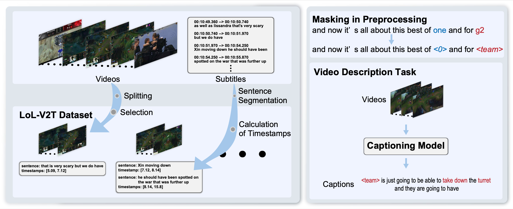
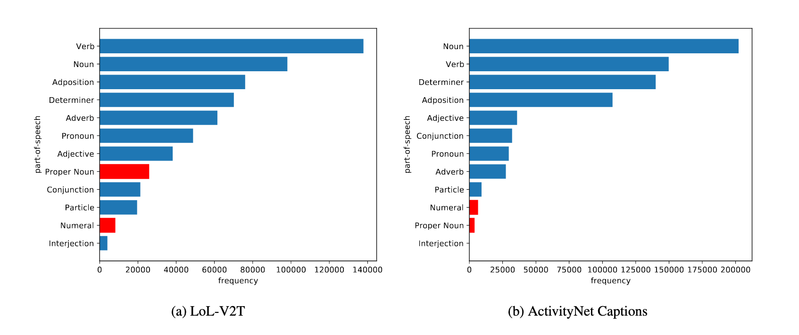

LoL-V2T is a new large-scale dataset for video description in esports.

# Abstract
Esports is a fastest-growing new field with a largely online-presence, and is creating a demand for automatic domain-specific captioning tools. However, at the current time, there are few approaches that tackle the esports video description problem. In this work, we propose a large-scale dataset for esports video description, focusing on the popular game "League of Legends". The dataset, which we call LoL-V2T, is the largest video description dataset in the video game domain, and includes 9,723 clips with 62,677 captions. This new dataset presents multiple new video captioning challenges such as large amounts of domain-specific vocabulary, subtle motions with large importance, and a temporal gap between most captions and the events that occurred. In order to tackle the issue of vocabulary, we propose a masking the domain-specific words and provide additional annotations for this. In our results, we show that the dataset poses a challenge to existing video captioning approaches, and the masking can significantly improve performance. Our dataset and code is publicly available. 

## Overall Introduction
<iframe width="560" height="315" src="https://www.youtube.com/embed/Lc8XV7_mUlE" title="YouTube video player" frameborder="0" allow="accelerometer; autoplay; clipboard-write; encrypted-media; gyroscope; picture-in-picture" allowfullscreen></iframe>

# Statistics

It consists of 9.7k clips of _League of Legends_ playing video taken from YouTube and 63k cap-tions. Each video is associated with multiple captions based on manual or ASR-generated subtitles.
We collect footages of 157 matches of the _League of Legends_ world championships “Worlds” from YouTube.

LoL-V2T has 3 different challenges for training captioning models.
* The captions contain a significant amountof proper nouns specific to the esports title and numerals that describe the status of matches.
* Some important objects in the clips are difficult for captioning models to recognize because their size and subtle motions.
* Some pairs of a clip and captions are not necessarily aligned temporally, i.e., there can be significant lag between game actions and captions.



# Downloads
Note that the raw video data are not published on this page, according to the [policy](https://www.riotgames.com/en/legal) set by Riot Games. You can create the dataset including raw video data using [our tool](https://github.com/Tsunehiko/create-lol-v2t).

[Annotations](https://esslab.jp/~tanaka/dataset/lol-v2t/annotations/annotations.tar.gz) | [Train(10.6GB)](https://esslab.jp/~tanaka/dataset/lol-v2t/train/train.tar.gz) | [Test(3.1GB)](https://esslab.jp/~tanaka/dataset/lol-v2t/test/test.tar.gz) | [Val(1.3GB)](https://esslab.jp/~tanaka/dataset/lol-v2t/val/valid.tar.gz)

# Paper
[Download](https://esslab.jp/publications/TanakaCVPRW2021.pdf)

## Bibtex

```bibtex
@InProceedings{Tanaka_2021_CVPR,
    author    = {Tanaka, Tsunehiko and Simo-Serra, Edgar},
    title     = {LoL-V2T: Large-Scale Esports Video Description Dataset},
    booktitle = {Proceedings of the IEEE/CVF Conference on Computer Vision and Pattern Recognition (CVPR) Workshops},
    month     = {June},
    year      = {2021},
    pages     = {4557-4566}
}
```
